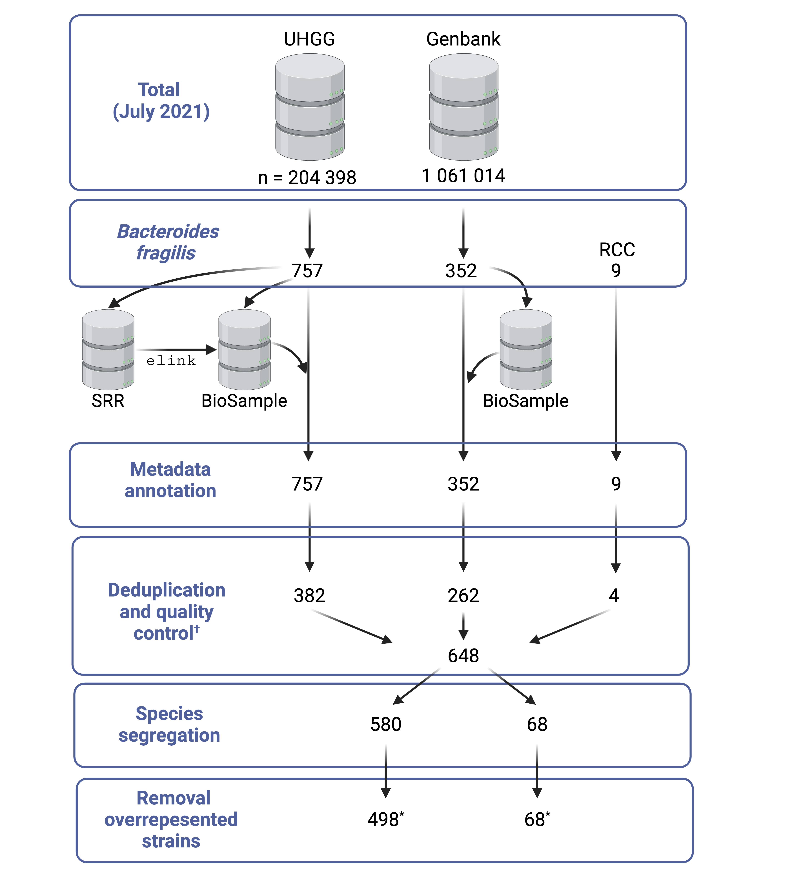

# Supplementary information

Supplementary information with the article 'Large-scale genomic characterisation of Bacteroides fragilis reveals multiple functionally divergent lineages and a distinct species.'

## Supplementary Data

### [Lineage specific genes](Supplementary_data/Lineage_specific_genes/lineage_specific_genes.tsv)

An overview table of the lineage specific genes identified in the B. fragilis pangenome. Based on the following conditions:

<!-- - Genes present in > 95% of the strains of a lineage and < 5% of the strains of the other lineages -->

### [Mobile genes](Supplementary_data/Mobile_genes/coinfinder_anno_mobile.tsv)

An overview table of the mobile genes identified in the B. fragilis pangenome. Based on the following conditions:

<!--  - Genes present in > 95% of the strains of a lineage and < 5% of the strains of the other lineages -->

### Multi locus sequence typing

-   The [standard output](Supplementary_data/Multi_locus_sequence_typing/mlst.stdout) of (MLST)[https://github.com/tseemann/mlst] using the B. fragilis scheme.
-   The [novel alleles](Supplementary_data/Multi_locus_sequence_typing/mlst_novel_alleles.fasta) identified in the MLST analysis.
-   The [lineage associated Sequencing Types](Supplementary_data/Multi_locus_sequence_typing/lineage_ST.tsv).

## Supplementary Figures

### Supplementary figure 1

_**Supplementary Figure 1:** Overview of data preprocessing steps. †Quality control measures are: contamination ≦ 5%, completeness ≧ 90%, 4.25Mbp ≦ genome size ≦ 5.75Mbp, # contigs ≦ 600, N’s per 100kbp ≦ 100. \*Final dataset used in downstream analysis, 498 of B. fragilis sensu stricto genomes and 68 B. fragilis A genomes._

### Supplementary figure 2
